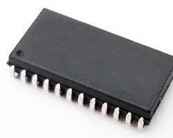
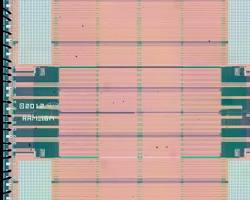
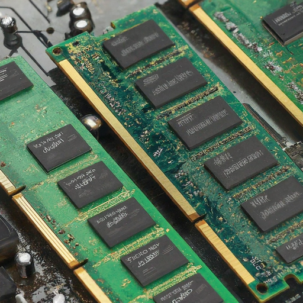
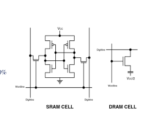
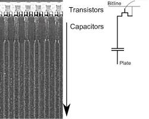
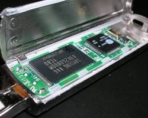
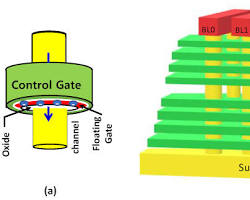
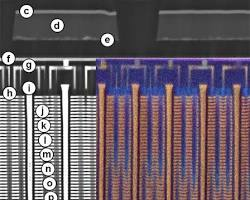

 

> 2024/05/01: 초안 작성  
> 2024/05/08: 문장 수정, NAND 개념 등 보완  
> 2024/05/09: SDRAM, DDR SDRAM 내용 추가  
> 2024/05/12: 메모리, 캐시, 버퍼 차이 내용 추가  

※ 내용에 오류가 있을 수 있습니다.  
※ 내용을 계속 추가, 수정, 보완하고 있습니다.  

 

**목차**

- [결론](#결론)
- [SRAM, DRAM, NAND 플래시 메모리, SDRAM, DDR SDRAM 비교](#sram-dram-nand-플래시-메모리-sdram-ddr-sdram-비교)
- [SRAM, DRAM, Nand Flash Memory 내외부 비교](#sram-dram-nand-flash-memory-내외부-비교)
  - [SRAM (정적 랜덤 액세스 메모리)](#sram-정적-랜덤-액세스-메모리)
  - [DRAM (동적 랜덤 액세스 메모리)](#dram-동적-랜덤-액세스-메모리)
  - [NADN Flash Memory (낸드 플래시 메모리)](#nadn-flash-memory-낸드-플래시-메모리)
- [SRAM, DRAM, Nand Flash Memory, SDRAM, DDR SDRAM 특징 비교](#sram-dram-nand-flash-memory-sdram-ddr-sdram-특징-비교)
  - [SRAM 특징, 용도, 플립플롭 Flip-flop](#sram-특징-용도-플립플롭-flip-flop)
  - [DRAM 특징, 용도, 리프레시 Refresh, 커패시터 Capacitor](#dram-특징-용도-리프레시-refresh-커패시터-capacitor)
  - [NAND 용어, NAND Flash 특징, 용도, NAND 게이트 NAND Gate](#nand-용어-nand-flash-특징-용도-nand-게이트-nand-gate)
  - [SDRAM 개념, 특징, 용도, NAND 게이트 NAND Gate](#sdram-개념-특징-용도-nand-게이트-nand-gate)
  - [DDR SDRAM 개념, 특징, 용도, NAND 게이트 NAND Gate](#ddr-sdram-개념-특징-용도-nand-게이트-nand-gate)
- [메모리 Memory, 캐시 Cache, 버퍼 Buffer의 차이](#메모리-memory-캐시-cache-버퍼-buffer의-차이)
- [참고자료](#참고자료)

 

## 결론

 

- SRAM, DRAM, NAND 플래시 메모리는 고유한 특성으로 인해 컴퓨팅에서 각각 다른 용도로 사용됨.

- SRAM은 캐시 메모리 및 레지스터와 같은 고속 연산에 사용되고, DRAM은 컴퓨터의 주 메모리로 사용되며, NAND 플래시는 저장 장치 및 임베디드 시스템에서 사용됨.

- 플립플롭 Flip-flop, 커패시터 Capacitor, Refresh 주기, NAND Gate 등의 개념과 함께 이러한 메모리 유형 간의 차이점을 이해하는 것은 컴퓨터에서 데이터가 저장되고 액세스되는 방식을 파악하고, 어디에 사용될 수 있는지 이해하는 데 필수

- SRAM은 빠른 휘발성 데이터 저장을 위해 플립플롭을 사용하고, DRAM은 SRAM 보다 느린 휘발성 데이터를 저장하기 위해 커패시터를 사용함. 낸드 플래시 메모리는 NAND Gate 사용함으로써 전원 없이도 비휘발성으로 저장된 데이터를 유지할 수 있음.
  
- SDRAM과 DDR SDRAM은 시스템 클럭과 작동을 동기화하는 DRAM 유형으로, 비동기식인 DRAM에 비해 더 빠른 데이터 전송 속도와 더 높은 메모리 대역폭을 제공함. 

- DDR SDRAM은 Double Data Rate를 통해 데이터 전송 속도를 두 배로 높여 성능을 더욱 향상시켜 고성능 컴퓨팅 애플리케이션에 적합

 

## SRAM, DRAM, NAND 플래시 메모리, SDRAM, DDR SDRAM 비교

 

- SRAM(정적 랜덤 액세스 메모리), DRAM(동적 랜덤 액세스 메모리), NAND 플래시 메모리는 모두 데이터를 일시적 또는 영구적으로 저장하는 데 사용되는 컴퓨터 메모리 유형

- 각각 고유한 특성, 용도, 메커니즘이 있어 서로 구별됨.

- 접근 속도 Access Velocity는 SRAM > SDRAM, DDR SDRAM > DRAM > NAND Flash

 

SRAM, DRAM, NAND Flash 메모리 비교

 

|  | SRAM | DRAM | NAND Flash Memory | SDRAM | DDR SDRAM |
|------------------------|-------------------------------------|-------------------------------------|-------------------------------------|-------------------------------------|-------------------------------------|
| **기술** | 플립플롭 사용 | 커패시터 및 트랜지스터 사용 | NAND 게이트 사용 | 커패시터 및 트랜지스터 사용 | 커패시터 및 트랜지스터 사용 |
| **휘발성** | 휘발성 | 휘발성, Refresh 필요 | 비휘발성 | 휘발성  | 휘발성 |
**접근 속도** | DRAM보다 빠름 | SRAM보다 느림 | SRAM, DRAM보다 느림 | DRAM보다 빠르나 SRAM보다 느림 | SDRAM과 유사함 |
| **전력 사용량** | DRAM보다 많은 전력 소비 | SRAM보다 적은 전력 소비 | 상대적으로 낮은 전력 소비 | 보통의 전력 사용량 | 보통의 전력 사용량 |
| **밀도** | 낮은 밀도, 비쌈 | 높은 밀도, SRAM보다 저렴 | 매우 높은 밀도 | 더 낮은 밀도 | 더 높은 밀도 |
| **사용 사례** | CPU 캐시, 고속 레지스터 | 메인 시스템 메모리, 모바일 장치 | SSD, USB 플래시 드라이브, 메모리 카드| 메인 메모리(RAM), 임베디드 시스템 | 메인 메모리(RAM), 그래픽 카드 |
| **구성요소** | 플립플롭 | 커패시터 | NAND 게이트 | 커패시터 | 커패시터 |
| **역할** |  기본 스토리지 요소 | 충전 저장 | 데이터 저장 | 데이터 저장 | 데이터 저장 |
| **Refresh 여부** | - | 주기적으로 필요 | - | 주기적으로 필요 | 주기적으로 필요 |
| **Refresh 프로세스** |  - | 데이터 읽기 및 다시 쓰기 포함| - | 주기적 Refresh | 주기적 Refresh |

 

## SRAM, DRAM, Nand Flash Memory 내외부 비교

 

### SRAM (정적 랜덤 액세스 메모리)

 

출처: https://www.researchgate.net/figure/Diagram-of-the-SRAM-cell-circuit-of-the-write-operation_fig1_276489541

 

출처: https://www.electronics-lab.com/mikron-1663ru1-16-mibit-sram-weekend-die-shot/

 

- SRAM 외부는 여러 개의 핀이 있는 소형 패키지처럼 생겼으며, 특수 회로에 자주 사용

- 내부는 SRAM은 메모리 비트당 6개의 트랜지스터가 있는 복잡한 회로를 사용하여 지속적인 Refresh 없이 데이터 보관 가능

- 반도체 용어 중 Die 다이란 정육면체란 의미로서 (cf. 주사위 Dice) 집적 회로에서 다이란 특정 기능을 하는 회로 블록을 의미함.

 

### DRAM (동적 랜덤 액세스 메모리)

 

출처: https://www.cl.cam.ac.uk/research/srg/han/ACS-P35/obj-4.2/zhpd6128849e.html

 

출처: https://www.researchgate.net/figure/Cross-section-of-a-deep-trench-DRAM-array-90-nm-technology-and-equivalent-circuit-of_fig1_234107645

 

- DRAM 외부는 칩이 많은 대형 모듈로 제공되며, 주로 메인 시스템 메모리에 사용됨.

- DRAM 내부는 비트당 1개의 트랜지스터와 커패시터로 구성된 더 단순한 회로를 사용하므로 밀도가 높지만 데이터를 유지하기 위해 지속적으로 전하를 공급하는 Refresh를 해야 함.

 

### NADN Flash Memory (낸드 플래시 메모리)

 

 

출처: https://www.mdpi.com/2079-9292/11/3/424

 

출처: https://www.researchgate.net/figure/3D-V-NAND-flash-memory-cross-section-sample-after-argon-ion-milling-at-6-keV-and-energy_fig8_317021537

 

- NAND 플래시 외부는 다양한 패키지로 제공되며, USB 드라이브 및 SSD와 같은 솔리드 스테이트 스토리지에 사용됨.

- NAND 플래시 내부는 상호 연결된 메모리 셀 그리드를 사용하며, 각 셀은 다양한 전압 레벨을 사용하여 여러 비트를 저장함. 따라서 밀도는 높지만 SRAM 및 DRAM에 비해 액세스 시간이 느림.

 

## SRAM, DRAM, Nand Flash Memory, SDRAM, DDR SDRAM 특징 비교

 

### SRAM 특징, 용도, 플립플롭 Flip-flop

 

- SRAM 특징
    
  - 변동성: SRAM은 휘발성이 있으므로 저장된 정보를 유지하기 위해 전원이 필요함.

  - 속도: SRAM은 DRAM 및 NAND flash보다 빠르므로 캐시 메모리 및 기타 고속 애플리케이션에 적합

  - 구조: 플립플롭 Flip-flops를 사용하여 각 비트의 데이터를 저장하므로 빠른 읽기 및 쓰기 작업이 가능

 

- SRAM 용도

  - 캐시 메모리: 빠른 속도 때문에 SRAM은 자주 액세스하는 데이터를 저장하기 위해 CPU의 캐시 메모리에 사용됨.

  - 레지스터: 처리 중인 데이터를 저장하기 위해 CPU 내의 레지스터에도 사용됨.

 

- 플립플롭 Flip-flop
  
  - 플립플롭의 어원은 걸을 때 신발이 발뒤꿈치와 바닥에 부딪히며 내는 소리 의성어임.
  
  - 출력 상태를 0에서 1로 또는 1에서 0으로 '플립 Flip'하고 클록 신호에 의해 트리거되면 다시 원래 상태로 '플롭 Flop'하는 회로의 기능에서 유래함. 
  
  - 이 동작은 메모리가 변경되거나 읽힐 때까지 저장된 데이터를 유지할 수 있게 해주므로 SRAM의 작동에 매우 중요
  
  - 플립플롭은 1비트 데이터를 저장하는 데 사용되는 디지털 전자기기의 기본 구성 요소
  
  - 동기식(클록 신호의 상승 에지에 데이터가 저장됨) 또는 비동기식(클록 신호와 독립적으로 데이터가 저장됨)일 수 있음.
 
  - SRAM에서는 플립플롭을 사용하여 각 비트의 데이터를 저장하므로 빠른 읽기 및 쓰기 작업이 가능함.

 

### DRAM 특징, 용도, 리프레시 Refresh, 커패시터 Capacitor

 

- DRAM 특징

  - 변동성: SRAM과 마찬가지로 DRAM은 휘발성이 있음.

  - 속도: DRAM은 SRAM보다는 느리지만 NAND 플래시보다는 빠름.

  - 구조: DRAM은 집적 회로 내의 커패시터에 각 데이터 비트를 저장함. 저장된 데이터를 유지하려면 커패시터를 주기적으로 새로 고쳐야 함.

 

- DRAM 용도
  
  - 주 메모리: DRAM은 컴퓨터의 주 메모리로 사용되며 운영 체제, 
애플리케이션, 데이터를 저장함.

  - 그래픽 메모리: 텍스처 및 기타 그래픽 데이터를 저장하기 위해 그래픽 
카드에도 사용됨.

- Refresh 주기: 커패시터는 시간이 지남에 따라 충전량이 줄어들기 때문에 데이터 손실을 방지하기 위해 주기적으로(몇 밀리초마다) 데이터를 새로 고쳐야 함.

 

> 리프레시 Refresh란  
> 
> DRAM의 커패시터는 시간이 지남에 따라 전하를 잃기 때문에 데이터 손실을 방지하기 위해 주기적으로(몇 밀리초마다) 커패시터에 저장된 데이터를 새로 고쳐야 함.  
> 
> 이 Refresh 작업은 메모리 컨트롤러가 관리하며, 메모리 컨트롤러는 주기적으로 커패시터를 새로 고치라는 신호를 보냄.

 

- 커패시터 Capacitor

  - 커패시터는 DRAM과 NAND 플래시 메모리 모두에서 데이터를 저장하는 데 사용됨. 

  - DRAM에서는 데이터의 각 비트가 커패시터에 저장되며, 저장된 데이터를 유지하기 위해 주기적으로 전하를 공급해야함.

  - NAND 플래시에서 커패시터는 플로팅 게이트 트랜지스터 floating-gate transistor의 일부이며, 플로팅 게이트의 전하가 저장된 데이터를 나타냄.

 

### NAND 용어, NAND Flash 특징, 용도, NAND 게이트 NAND Gate

 

- NAND란

  - “NOT AND”의 약자로, NAND 셀의 내부 회로를 제어하는 부울 Boolean 연산자 또는 논리 게이트를 의미함.
  
  - NAND 연산자는 두 입력이 모두 TRUE인 경우에만 FALSE 값을 생성함.

 

- NAND Flash 특징

  - 비휘발성: SRAM 및 DRAM과 달리 NAND 플래시 메모리는 비휘발성이므로 전원 없이도 저장된 정보를 유지할 수 있음.

  - 내구성: NAND 플래시는 쓰기 횟수가 많기 때문에 USB 드라이브, SSD, 플래시 메모리 카드와 같은 저장 장치에 적합함.

  - 구조: NAND 플래시 메모리는 플로팅 게이트 트랜지스터에 데이터를 저장함. 데이터는 플로팅 게이트의 전하를 감지하여 읽음.

 

- NAND Flash 용도

  - 저장 장치: NAND 플래시는 SSD(솔리드 스테이트 드라이브), USB 플래시 드라이브, 메모리 카드에 사용됨.

  - 임베디드 시스템: 비휘발성과 내구성으로 인해 데이터 저장을 위한 임베디드 시스템에도 사용됨.

 

- NAND 게이트 NAND Gate

  - 디지털 전자기기에서 NAND Gate는 모든 입력이 참인 경우에만 거짓인 출력을 생성하는 논리 게이트로, AND 게이트의 출력을 보완하는 역할을 함. 게이트에 대한 모든 입력이 높을 경우에만 LOW 출력이 발생하고, 입력이 낮으면 HIGH 출력이 발생
  
  - ***낸드 플래시 메모리와 낸드 게이트는 같은 “NAND”이지만 서로 다른 원리로 작동***

  - 낸드 플래시 메모리는 데이터 저장을 위해 낸드 게이트가 아닌 Floating Gate Transister의 낸드 구성을 사용함.
  
  - NAND 플래시 메모리의 저장 메커니즘은 플로팅 게이트에서 전자를 주입하거나 제거하여 트랜지스터의 임계 전압을 변경할 수 있는 기능을 기반으로 함.
  
  - 이를 통해 낸드 플래시 메모리는 비휘발성으로 전원 없이도 저장된 데이터를 유지할 수 있음. 반면, SRAM은 빠른 휘발성 데이터 저장을 위해 플립플롭을 사용하고, DRAM은 느린 휘발성 데이터 저장을 위해 커패시터를 사용함.

### SDRAM 개념, 특징, 용도, NAND 게이트 NAND Gate

 

- SDRAM 개념
 
  - SDRAM Synchronous Dynamic Random-Access Memory 동기식 동적 랜덤 액세스 메모리

  - SDRAM은 시스템 클럭과 작동을 동기화하는 동적 랜덤 액세스 메모리(DRAM)의 한 유형임.

  - 시스템 클럭과 독립적으로 작동하고 대기 상태가 필요한 비동기식 DRAM과 달리 ***SDRAM은 클럭 신호에 따라 데이터 전송을 조정***하므로 데이터 전송 속도가 더 빠름.

 

- SDRAM 특징
  
  - 동기화: SDRAM은 데이터 읽기 및 쓰기와 같은 내부 작업을 시스템 클럭과 동기화함. 이러한 동기화를 통해 비동기식 DRAM에 비해 정확한 타이밍과 빠른 데이터 전송 속도 구현 가능
  
  - 버스트 모드 Burst Mode: SDRAM은 버스트 모드를 지원하여 단일 주소를 수신한 후 여러 데이터 워드를 연속적으로 빠르게 전송할 수 있음. 이 기능은 메모리 대역폭과 전반적인 시스템 성능을 향상시킴.
  
  - 파이프라인 아키텍처 Pipeline Architecture: SDRAM은 파이프라인 아키텍처를 채택하여 여러 메모리 요청을 중복 처리할 수 있음. 지연 시간을 줄이고 메모리 효율성을 향상시킴.
  
  - 변형: SDRAM은 클록 사이클당 한 번 데이터를 전송하는 SDR SDRAM(Single Data Rate Synchronous DRAM)과 클록 사이클당 두 번 데이터를 전송하는 DDR SDRAM(Double Data Rate Synchronous DRAM) 등 다양한 형태로 제공됨.

 

### DDR SDRAM 개념, 특징, 용도, NAND 게이트 NAND Gate

 

- DDR SDRAM Double Data Rate Synchronous Dynamic Random-Access Memory 더블 데이터 전송률 동기식 동적 랜덤 액세스 메모리

- DDR SDRAM은 클럭 신호의 상승 및 하강 edges 모두에서 데이터를 전송하여 데이터 전송 속도를 두 배로 높이는 SDRAM의 발전된 버전

- 이중 데이터 전송률(DDR) 작동은 기존 SDRAM에 비해 메모리 대역폭을 효과적으로 두 배로 늘림.

 

- DDR SDRAM 특징

  - 더블 데이터 전송률: DDR SDRAM은 클럭 신호의 상승 에지와 하강 에지 모두에서 데이터를 전송하므로 SDR SDRAM에 비해 데이터 전송 속도가 효과적으로 두 배가 됨. 예를 들어, 200MHz에서 실행되는 DDR SDRAM은 400MT/s(초당 백만 번의 전송)임.

  - 향상된 대역폭: 데이터 전송 속도를 두 배로 높인 DDR SDRAM은 게임, 멀티미디어, 데이터 처리와 같은 까다로운 애플리케이션에 필수적인 메모리 대역폭을 더 많이 제공함.

  - 변형: DDR SDRAM은 DDR, DDR2, DDR3, DDR4, DDR5 등 여러 가지 버전으로 제공되며, 각 버전은 이전 버전에 비해 데이터 전송률 증가, 전력 소비 감소, 향상된 성능을 제공함.

  - 이전 버전과의 호환성: DDR SDRAM 모듈은 일반적으로 이전 DDR 표준과 호환되어, 필요한 경우 더 낮은 속도로 작동할 수 있음. 이러한 호환성 덕분에 메모리 인프라를 완전히 점검할 필요 없이 기존 시스템을 쉽게 업그레이드할 수 있음.
  
 

## 메모리 Memory, 캐시 Cache, 버퍼 Buffer의 차이

 

- 메모리, 캐시, 버퍼는 **모두 데이터 저장, 검색을 처리하지만 크기, 속도, 변동성, 목적이 다름**.

- 메모리는 컴퓨터 시스템의 성능과 효율성에 중요한 역할을 하며, 캐시는 속도를 향상시키고, 버퍼는 원활한 데이터 전송을 보장하는 역할을 함.

> - 메모리는 데이터와 명령어를 위한 기본 저장소로, CPU가 활성 처리를 위해 사용
> - 캐시는 자주 사용하는 데이터를 CPU 가까이에 저장하여 데이터 액세스 속도를 높이는 데 사용되는 *고속 스토리지 메커니즘*
> - 버퍼는 장치 또는 시스템 일부 간의 데이터 전송을 관리하는 데 사용되는 임시 저장 영역으로, 전송 중 데이터 손실을 방지

- 캐시란 프로세서 내부 또는 프로세서와 주 메모리 사이에 위치한 소량의 고속 메모리. 자주 액세스하는 데이터나 명령어를 저장하여 액세스하는 데 걸리는 시간을 줄이는 데 사용됨.

- 캐시의 목적은 곧 필요할 가능성이 있는 데이터의 사본을 저장하여 데이터 검색 속도를 높이는 것. 프로세서와 주 메모리 사이의 다리 역할을 하여 속도가 느린 주 메모리에서 데이터에 액세스하는 데 걸리는 대기 시간을 줄여줌.

- 캐시는 L1, L2, L3 캐시와 같은 레벨로 나눌 수 있으며, L1은 가장 작고 빠르며 L3은 더 크고 느립니다.

- ***버퍼란 데이터를 한 곳에서 다른 곳으로 이동하는 동안 일시적으로 저장하는 데 사용되는 물리적 메모리 저장 영역***. 버퍼는 장치 간 또는 컴퓨터 시스템의 다른 부분 간에 전송되는 데이터를 보관하는 데 사용

- 버퍼의 목적은 장치 또는 시스템 간에 데이터를 전송하는 동안 *데이터 손실을 방지*하는 것. 디스크 드라이브나 네트워크 인터페이스와 같은 장치에서 읽거나 쓰는 데이터를 임시로 저장할 수 있음.

- **버퍼는 소프트웨어 또는 하드웨어로 구현할 수 있음**. 소프트웨어 버퍼는 애플리케이션에서 데이터 흐름을 관리하는 데 사용되며, 하드웨어 버퍼는 장치에서 데이터 전송을 관리하는 데 사용됨.

 
 

## 참고자료

[Wikipedia] Static random-access memory  
<https://en.wikipedia.org/wiki/Static_random-access_memory>

[Wikipedia] Flip-flop (electronics)  
<https://en.wikipedia.org/wiki/Flip-flop_(electronics)>

[Wikipedia] Dynamic random-access memory  
<https://en.wikipedia.org/wiki/Static_random-access_memory>

[Wikipedia] Capacitor  
<https://en.wikipedia.org/wiki/Capacitor>

[Wikipedia] Flash memory   
<https://en.wikipedia.org/wiki/Flash_memory#NAND_flash>

[Wikipedia] NAND Gate  
<https://en.wikipedia.org/wiki/NAND_gate>

[Wikipedia] Die (integrated circuit)  
<https://en.wikipedia.org/wiki/Die_(integrated_circuit)>

[Wikipedia] Synchronous dynamic random-access memory  
<https://en.wikipedia.org/wiki/Synchronous_dynamic_random-access_memory>

[Wikipedia] DDR SDRAM    
<https://en.wikipedia.org/wiki/DDR_SDRAM>
