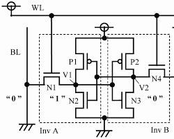

 

> 2024/05/01: 초안 작성
 
※ 내용에 오류가 있을 수 있습니다.

 

**목차**

- [결론](#결론)
- [SRAM, DRAM, NAND 플래시 메모리 비교](#sram-dram-nand-플래시-메모리-비교)
- [SRAM, DRAM, Nand Flash Memory 내외부 비교](#sram-dram-nand-flash-memory-내외부-비교)
  - [SRAM(정적 랜덤 액세스 메모리)](#sram정적-랜덤-액세스-메모리)
  - [DRAM(동적 랜덤 액세스 메모리)](#dram동적-랜덤-액세스-메모리)
  - [NADN Flash Memory 낸드 플래시 메모리](#nadn-flash-memory-낸드-플래시-메모리)
- [SRAM, DRAM, Nand Flash Memory 특징 비교](#sram-dram-nand-flash-memory-특징-비교)
  - [SRAM 특징, 용도, 플립플롭 Flip-flop](#sram-특징-용도-플립플롭-flip-flop)
  - [DRAM 특징, 용도, 리프레시 Refresh, 커패시터 Capacitor](#dram-특징-용도-리프레시-refresh-커패시터-capacitor)
  - [NAND 용어, NAND Flash 특징, 용도, NAND 게이트 NAND Gate](#nand-용어-nand-flash-특징-용도-nand-게이트-nand-gate)
- [참고자료](#참고자료)

 

## 결론

 

- SRAM, DRAM, NAND 플래시 메모리는 고유한 특성으로 인해 컴퓨팅에서 각각 다른 용도로 사용됨.

- SRAM은 캐시 메모리 및 레지스터와 같은 고속 연산에 사용되고, DRAM은 컴퓨터의 주 메모리로 사용되며, NAND 플래시는 저장 장치 및 임베디드 시스템에서 사용됨.

- 플립플롭 Flip-flop, 커패시터 Capacitor, Refresh 주기, NAND Gate 등의 개념과 함께 이러한 메모리 유형 간의 차이점을 이해하는 것은 컴퓨터에서 데이터가 저장되고 액세스되는 방식을 파악하고, 어디에 사용될 수 있는지 이해하는 데 필수

- SRAM은 빠른 휘발성 데이터 저장을 위해 플립플롭을 사용하고, DRAM은 느린 휘발성 데이터 저장을 위해 커패시터를 사용함. 낸드 플래시 메모리는 NAND Gate 사용함으로써 전원 없이도 비휘발성으로 저장된 데이터를 유지할 수 있음.
  
 

## SRAM, DRAM, NAND 플래시 메모리 비교

 

- SRAM(정적 랜덤 액세스 메모리), DRAM(동적 랜덤 액세스 메모리), NAND 플래시 메모리는 모두 데이터를 일시적 또는 영구적으로 저장하는 데 사용되는 컴퓨터 메모리 유형

- 각각 고유한 특성, 용도, 메커니즘이 있어 서로 구별됨.

 

SRAM, DRAM, NAND Flash 메모리 비교

 

| 기능 | SRAM | DRAM | 낸드 플래시 메모리 |
|------------------------|-------------------------------------|-------------------------------------|-------------------------------------|
| **기술** | 플립플롭 사용 | 커패시터 및 트랜지스터 사용 | NAND 게이트 사용 |
| **변동성** | 비휘발성 | 휘발성, Refresh 필요 | 비휘발성 | 비휘발성
**접속 시간** | DRAM보다 빠름 | SRAM보다 느림 | SRAM 및 DRAM보다 느림 |
| **전력 사용량** | 더 많은 전력 소비 | 더 적은 전력 소비 | 상대적으로 낮은 전력 소비
| **밀도** | 낮은 밀도, 더 비싸다 | 높은 밀도, 더 저렴하다 | 매우 높은 밀도
| **사용 사례** | CPU 캐시, 고속 레지스터 | 메인 시스템 메모리, 모바일 장치 | SSD, USB 플래시 드라이브, 메모리 카드|
| **구성요소** | 플립플롭 | 커패시터 | NAND 게이트 |
| **역할** |  기본 스토리지 요소 | 충전 저장 | 데이터 저장 | 
| **Refresh 여부** | - | 주기적으로 필요 | - |
| **Refresh 프로세스** |  - | 데이터 읽기 및 다시 쓰기 포함| - |

 

## SRAM, DRAM, Nand Flash Memory 내외부 비교

 

### SRAM(정적 랜덤 액세스 메모리)

 

출처: https://www.researchgate.net/figure/Diagram-of-the-SRAM-cell-circuit-of-the-write-operation_fig1_276489541

 

출처: https://www.electronics-lab.com/mikron-1663ru1-16-mibit-sram-weekend-die-shot/

 

- SRAM 외부는 여러 개의 핀이 있는 소형 패키지처럼 생겼으며, 특수 회로에 자주 사용

- 내부는 SRAM은 메모리 비트당 6개의 트랜지스터가 있는 복잡한 회로를 사용하여 지속적인 Refresh 없이 데이터 보관 가능

- 반도체 용어 중 Die 다이란 정육면체란 의미로서 (cf. 주사위 Dice) 집적 회로에서 다이란 특정 기능을 하는 회로 블록을 의미함.

 

### DRAM(동적 랜덤 액세스 메모리)

 

출처: https://www.cl.cam.ac.uk/research/srg/han/ACS-P35/obj-4.2/zhpd6128849e.html

 

출처: https://www.researchgate.net/figure/Cross-section-of-a-deep-trench-DRAM-array-90-nm-technology-and-equivalent-circuit-of_fig1_234107645

 

- DRAM 외부는 칩이 많은 대형 모듈로 제공되며, 주로 메인 시스템 메모리에 사용됨.

- DRAM 내부는 비트당 1개의 트랜지스터와 커패시터로 구성된 더 단순한 회로를 사용하므로 밀도가 높지만 데이터를 유지하기 위해 지속적으로 전하를 공급하는 Refresh를 해야 함.

 

### NADN Flash Memory 낸드 플래시 메모리

 

 

출처: https://www.mdpi.com/2079-9292/11/3/424

 

출처: https://www.researchgate.net/figure/3D-V-NAND-flash-memory-cross-section-sample-after-argon-ion-milling-at-6-keV-and-energy_fig8_317021537

 

- NAND 플래시 외부는 다양한 패키지로 제공되며, USB 드라이브 및 SSD와 같은 솔리드 스테이트 스토리지에 사용됨.

- NAND 플래시 내부는 상호 연결된 메모리 셀 그리드를 사용하며, 각 셀은 다양한 전압 레벨을 사용하여 여러 비트를 저장함. 따라서 밀도는 높지만 SRAM 및 DRAM에 비해 액세스 시간이 느림.

 

## SRAM, DRAM, Nand Flash Memory 특징 비교

 

### SRAM 특징, 용도, 플립플롭 Flip-flop

 

- SRAM 특징
    
  - 변동성: SRAM은 휘발성이 있으므로 저장된 정보를 유지하기 위해 전원이 필요함.

  - 속도: SRAM은 DRAM 및 NAND flash보다 빠르므로 캐시 메모리 및 기타 고속 애플리케이션에 적합

  - 구조: 플립플롭 Flip-flops를 사용하여 각 비트의 데이터를 저장하므로 빠른 읽기 및 쓰기 작업이 가능

 

- SRAM 용도

  - 캐시 메모리: 빠른 속도 때문에 SRAM은 자주 액세스하는 데이터를 저장하기 위해 CPU의 캐시 메모리에 사용됩니다.

  - 레지스터: 처리 중인 데이터를 저장하기 위해 CPU 내의 레지스터에도 사용됩니다.

 

- 플립플롭 Flip-flop
  
  - 플립플롭의 어원은 걸을 때 신발이 발뒤꿈치와 바닥에 부딪히며 내는 소리 의성어임.
  
  - 출력 상태를 0에서 1로 또는 1에서 0으로 '플립 Flip'하고 클록 신호에 의해 트리거되면 다시 원래 상태로 '플롭 Flop'하는 회로의 기능에서 유래함. 
  
  - 이 동작은 메모리가 변경되거나 읽힐 때까지 저장된 데이터를 유지할 수 있게 해주므로 SRAM의 작동에 매우 중요
  
  - 플립플롭은 1비트 데이터를 저장하는 데 사용되는 디지털 전자기기의 기본 구성 요소
  - 
  - 동기식(클록 신호의 상승 에지에 데이터가 저장됨) 또는 비동기식(클록 신호와 독립적으로 데이터가 저장됨)일 수 있음.
  - 
  - SRAM에서는 플립플롭을 사용하여 각 비트의 데이터를 저장하므로 빠른 읽기 및 쓰기 작업이 가능함.

 

### DRAM 특징, 용도, 리프레시 Refresh, 커패시터 Capacitor

 

- DRAM 특징

  - 변동성: SRAM과 마찬가지로 DRAM은 휘발성이 있습니다.

  - 속도: DRAM은 SRAM보다는 느리지만 NAND 플래시보다는 빠릅니다.

  - 구조: DRAM은 집적 회로 내의 커패시터에 각 데이터 비트를 저장합니다. 
  저장된 데이터를 유지하려면 커패시터를 주기적으로 새로 고쳐야 합니다.

 

- DRAM 용도
  
  - 주 메모리: DRAM은 컴퓨터의 주 메모리로 사용되며 운영 체제, 
애플리케이션, 데이터를 저장합니다.

  - 그래픽 메모리: 텍스처 및 기타 그래픽 데이터를 저장하기 위해 그래픽 
카드에도 사용됩니다.

- Refresh 주기: Refresh 주기는 DRAM 작동의 중요한 측면입니다. 커패시터는 시간이 지남에 따라 충전량이 줄어들기 때문에 데이터 손실을 방지하기 위해 주기적으로(몇 밀리초마다) 데이터를 새로 고쳐야 합니다.

 

> 리프레시 Refresh란  
> 
> DRAM의 커패시터는 시간이 지남에 따라 전하를 잃기 때문에 데이터 손실을 방지하기 위해 주기적으로(몇 밀리초마다) 커패시터에 저장된 데이터를 새로 고쳐야 함.  
> 
> 이 Refresh 작업은 메모리 컨트롤러가 관리하며, 메모리 컨트롤러는 주기적으로 커패시터를 새로 고치라는 신호를 보냄.

 

- 커패시터 Capacitor

  - 커패시터는 DRAM과 NAND 플래시 메모리 모두에서 데이터를 저장하는 데 사용됨. 

  - DRAM에서는 데이터의 각 비트가 커패시터에 저장되며, 저장된 데이터를 유지하기 위해 주기적으로 전하를 공급해야함.

  - NAND 플래시에서 커패시터는 플로팅 게이트 트랜지스터 floating-gate transistor의 일부이며, 플로팅 게이트의 전하가 저장된 데이터를 나타냄.

 

### NAND 용어, NAND Flash 특징, 용도, NAND 게이트 NAND Gate

 

- NAND란

  - “NOT AND”의 약자로, NAND 셀의 내부 회로를 제어하는 부울 Boolean 연산자 또는 논리 게이트를 의미함.
  
  - NAND 연산자는 두 입력이 모두 TRUE인 경우에만 FALSE 값을 생성합니다.

 

- NAND Flash 특징

  - 비휘발성: SRAM 및 DRAM과 달리 NAND 플래시 메모리는 비휘발성이므로 전원 없이도 저장된 정보를 유지할 수 있음.

  - 내구성: NAND 플래시는 쓰기 횟수가 많기 때문에 USB 드라이브, SSD, 플래시 메모리 카드와 같은 저장 장치에 적합함.

  - 구조: NAND 플래시 메모리는 플로팅 게이트 트랜지스터에 데이터를 저장합니다. 데이터는 플로팅 게이트의 전하를 감지하여 읽음.

 

- NAND Flash 용도

  - 저장 장치: NAND 플래시는 SSD(솔리드 스테이트 드라이브), USB 플래시 드라이브, 메모리 카드에 사용됨.

  - 임베디드 시스템: 비휘발성과 내구성으로 인해 데이터 저장을 위한 임베디드 시스템에도 사용됨.

 

- NAND 게이트 NAND Gate

  - 디지털 전자기기에서 NAND 게이트는 모든 입력이 참인 경우에만 거짓인 출력을 생성하는 논리 게이트로, AND 게이트의 출력을 보완하는 역할을 합니다. 게이트에 대한 모든 입력이 높을 경우에만 LOW 출력이 발생하고, 입력이 낮으면 HIGH 출력이 발생
  
  - 낸드 플래시 메모리와 낸드 게이트는 같은 “낸드”이지만 서로 다른 원리로 작동

  - 낸드 플래시 메모리는 데이터 저장을 위해 낸드 게이트가 아닌 플로팅 게이트 트랜지스터의 낸드 구성을 사용함.
  
  - NAND 플래시 메모리의 저장 메커니즘은 플로팅 게이트에서 전자를 주입하거나 제거하여 트랜지스터의 임계 전압을 변경할 수 있는 기능을 기반으로 함.
  
  - 이를 통해 낸드 플래시 메모리는 비휘발성으로 전원 없이도 저장된 데이터를 유지할 수 있음. 반면, SRAM은 빠른 휘발성 데이터 저장을 위해 플립플롭을 사용하고, DRAM은 느린 휘발성 데이터 저장을 위해 커패시터를 사용함.

  
 
 

## 참고자료

[Wikipedia] Static random-access memory  
<https://en.wikipedia.org/wiki/Static_random-access_memory>

[Wikipedia] Flip-flop (electronics)  
<https://en.wikipedia.org/wiki/Flip-flop_(electronics)>

[Wikipedia] Dynamic random-access memory  
<https://en.wikipedia.org/wiki/Static_random-access_memory>

[Wikipedia] Capacitor  
<https://en.wikipedia.org/wiki/Capacitor>

[Wikipedia] Flash memory   
<https://en.wikipedia.org/wiki/Flash_memory#NAND_flash>

[Wikipedia] NAND Gate  
<https://en.wikipedia.org/wiki/NAND_gate>

[Wikipedia] Die (integrated circuit)  
<https://en.wikipedia.org/wiki/Die_(integrated_circuit)>

